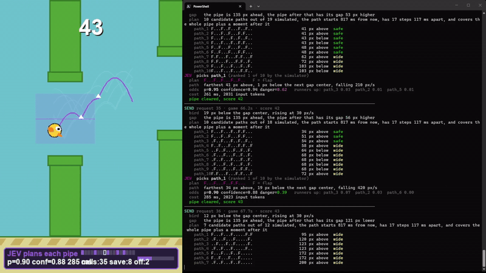
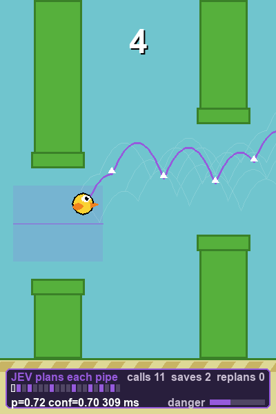

# JevBird

Flappy Bird in Python, played in real time by **Jev**, the System One model from [TypeSafe](https://typesafe.ai).

Jev never sees the screen. Every time a new pipe becomes the target, the game simulates a spread of possible flight paths through the gap and asks Jev one question: which path should the bird fly? Jev answers with a typed choice and a probability distribution, the game schedules every flap in the chosen path, and the bird flies it at full speed. That is roughly one API call per pipe.

## Demo



Left is the game, right is the live console. One request goes out per pipe, and every request and reply is printed as it happens.

Full recording: [demo/jev_plays_flappybird.mp4](demo/jev_plays_flappybird.mp4), 2 minutes 35 seconds at 1080p.

## Install

```
pip install -r requirements.txt
```

Needs Python 3.10 or newer. Installs `pygame` and `typesafe-sdk`.

## API key

Jev mode needs a TypeSafe API key from [console.typesafe.ai](https://console.typesafe.ai/). Put it in a `.env` file next to the script:

```
TYPESAFE_API_KEY=apikey_...
```

or set it in the environment:

```
set TYPESAFE_API_KEY=apikey_...
```

`.env` is gitignored. Without a key the game still runs in manual mode.

## Local model

To use a self-hosted System One server (for example Laya) instead, set its base URL in `.env` or the environment. No API key needed:

```
JEV_BASE_URL=http://localhost:8000
```

The game then sends plain `POST {JEV_BASE_URL}/v1/systemone` requests. When set, it takes priority over `TYPESAFE_API_KEY`.

## Run

```
python flappy_bird.py
```

Press **J** to hand control to Jev.

## Controls

| Key | Action |
| --- | --- |
| Space, Up, left click | Flap, start, restart |
| J | Toggle Jev mode |
| Escape | Quit |

The high score is saved to `highscore.txt`.

## What you see on screen



While Jev is flying, the game draws its thinking directly into the world:

- **Purple line** is the chosen flight path, projected forward from the bird.
- **White lines** are the rejected candidates, with opacity set by the probability Jev gave each one.
- **White arrows** mark the frames where a flap is scheduled.
- **Purple band** across the gap is the safe corridor, 55 px either side of the gap center.
- **Panel at the bottom** shows the chosen path's probability, Jev's confidence, the round-trip time, the step pattern of the current plan, a danger meter, and the running call count.

## What you see in the console

Every request and reply is logged. A request shows the state Jev receives and every candidate path with its worst deviation and whether it crashes. The reply shows the pick, the probability, the confidence, the runners up, the latency, and the token count.

```
SEND request 14 · game 21.3s · score 12
  bird   23 px below the gap center, falling at 180 px/s
  gap    the pipe is 214 px ahead, the pipe after that has its gap 64 px higher
  plan   10 candidate paths out of 23 simulated, the path starts 400 ms from now ...
    path_1 ....F..F...F...F..F.               44 px below  safe
    path_2 ...F...F..F...F...F.               51 px above  safe
JEV  picks path_1 (ranked 1 of 10 by the simulator)
  plan   ....F..F...F...F..F.   F = flap
  path   farthest 44 px below, 6 px above the next gap center, rising 210 px/s
  odds   p=0.92 confidence=0.90 danger=0.18   runners up: path_2 0.05  path_3 0.02
  cost   412 ms, 2106 input tokens
```

Set `JEV_LOG=0` in the environment to silence it.

## How it works

Short version: code owns the physics and the arithmetic, Jev owns the judgment.

1. **Predict the future.** Pipe gaps are decided before a pipe appears, so the game can simulate ahead exactly, including the pipe after the current one.
2. **Generate candidates.** Fifty-five simple flap policies are run through the simulator, which collapse to roughly twenty distinct paths covering the whole pipe plus 0.6 s beyond it.
3. **Prune in code.** Crashing paths are dropped, the rest are ranked by worst deviation from the gap center, and the best ten are sent.
4. **Ask Jev once.** One Choice question over the ten paths, plus one Noul question asking whether this pipe is dangerous, in the same request.
5. **Compensate for latency.** The state sent is projected forward to the frame the answer is expected to arrive, using a rolling estimate of round-trip time, so the chosen path starts at the right instant.
6. **Fly it, and watch it.** Every flap is scheduled on an exact frame. If the bird drifts more than 35 px off the planned path, the plan is abandoned and Jev is asked again. If a crash is coming within 0.3 s, a safety flap overrides the plan.

Full detail is in [HOW_JEV_PLAYS.md](HOW_JEV_PLAYS.md).

## Measured behavior

From headless test runs of 150 seconds each, on a residential connection:

| Metric | Value |
| --- | --- |
| API calls | about 0.55 per second, one per pipe |
| Input tokens per call | 1,800 to 2,800 |
| Round trip, typical | 0.30 s |
| Round trip, worst seen | 1.2 s |
| Score in the recording above | 47 pipes |

Scores vary between runs. Jev holds the middle of the corridor well, and most losses come from a slow reply during a tight pipe.

## Project layout

| File | Contents |
| --- | --- |
| `flappy_bird.py` | The game, the forward simulator, the plan scheduler, the overlay |
| `jev_pilot.py` | The TypeSafe integration, the questions, the console logging |
| `HOW_JEV_PLAYS.md` | Full explanation of what Jev sees and decides |
| `demo/` | Capture of Jev playing |

## Tuning

Constants at the top of `flappy_bird.py`:

- `JEV_STEP_FRAMES` is the spacing between actions in a path, in frames.
- `JEV_REPLAN_LEAD` is how early the next request goes out before the current path runs out.
- `JEV_DIVERGENCE_PX` is how far off-path the bird may drift before the plan is thrown away.
- `JEV_POLICY_BANDS` and `JEV_POLICY_SPEEDS` control how the candidate paths are generated.

In `jev_pilot.py`, `MAX_OPTIONS` sets how many paths Jev chooses between, and `SAFE_MARGIN_PX` sets the corridor width.

## License

MIT, see [LICENSE](LICENSE).
